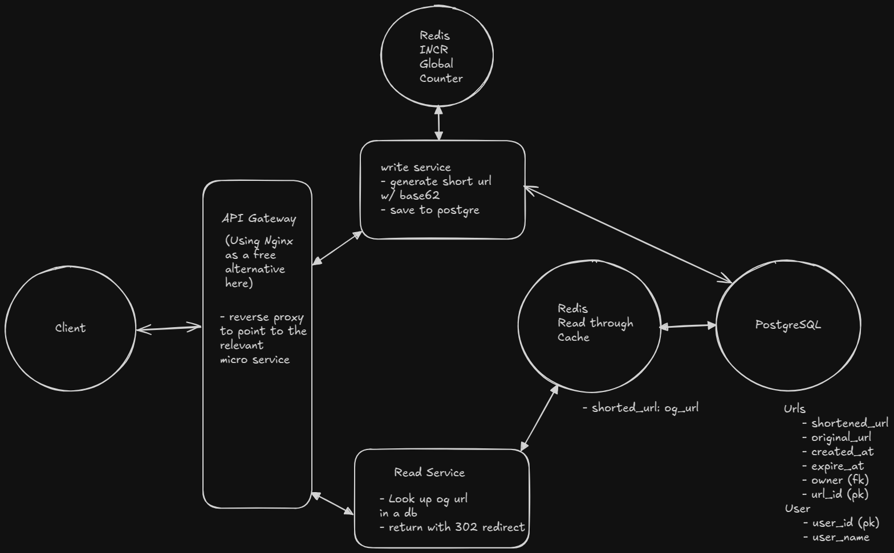

# Bitly System Design 

# Functional Requirements
- User should be able to subit a long url and get a short url back.
- User should be able to acess the long url by using the short url.

# Non-Functional Requirements
- The system should be able to handle 100M DAU.
- The system should be able to handle 1B shorten url requests per day.
- The system should generate unique short urls.
- The system should have high availability.

# bitly-system-design-implementation
